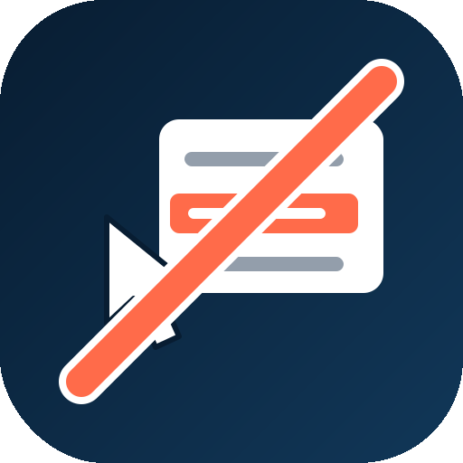

# FG Custom Right Click

A native Joomla system plugin that disables printing, text selection/copy,
image dragging, developer-tools keyboard shortcuts, and the browser's
right-click menu on the frontend — with an optional popup message or a
fully custom, ARIA-accessible context menu of your own.

Rebuilt from the ground up as a Joomla 6-native plugin (PSR-4,
`SubscriberInterface`, DI container via `services/provider.php`,
`WebAssetManager`), inspired by the discontinued Glimlag "Custom Right
Click for Joomla 3.X" extension.

## Features

- Apply rules to specific user groups only (or everyone)
- Disable printing (Ctrl/Cmd+P + print-output content hiding), delivered
  via an external stylesheet so it isn't dropped by a site's
  Content-Security-Policy the way an inline `<style>` can be
- Disable text selection & copying (form fields stay usable)
- Disable image dragging (and suppresses iOS/WebKit's long-press "Save
  Image"/"Save Video" callout, which right-click/drag prevention alone
  does not affect)
- Discourage developer-tools keyboard shortcuts (F12, Ctrl+Shift+I/J/C,
  Cmd+Opt+I/J/C, Ctrl/Cmd+U) - a minor deterrent, not a security measure;
  DevTools remain reachable via the browser's own menu regardless
- Skip protections on interactive elements by default (links, form
  fields, buttons, editable content) - keeps the normal "right-click a
  link to open it in a new tab" gesture and form usability intact;
  turn off to block truly everywhere
- Four right-click modes: default / disabled with popup / images-only
  (``/`<picture>` only by default, with opt-in toggles to also
  cover video and CSS background images) / fully custom menu
- Custom context menu builder: link or built-in action items (reload,
  copy URL, print, scroll to top, share), with icons, a `{url}` placeholder
  for links, and open-in-new-tab — no arbitrary code execution is possible
  anywhere in the plugin. Copy/share actions work on plain HTTP too (not
  just HTTPS) and show a brief confirmation toast either way
- Full keyboard accessibility: focus trap in the popup, roving-tabindex
  arrow-key navigation in the custom menu, focus returned on close
- Follows the site template's own light/dark theme (`data-bs-theme` /
  `data-color-scheme`) rather than the visitor's OS preference, respects
  `prefers-reduced-motion`, and uses logical CSS properties for RTL
  languages

## Installation

1. Download the latest release ZIP from the
   [Releases](https://github.com/ferino75/plg_system_fgcustomrightclick/releases)
   page.
2. In Joomla, go to **System → Install → Extensions** and upload the ZIP.
3. Enable the plugin under **System → Manage → Plugins** and search for
   "FG - Custom Right Click".

## Requirements

Joomla 4, 5, or 6.

## License

GPL-2.0-or-later. See [LICENSE](LICENSE).

## Development

The `tests/` directory has the full behavioural/unit test suite (jsdom
for JS, reflection-based for PHP) referenced throughout CHANGELOG.md.
See `tests/README.md` for how to run it. These are development tooling
only and are not part of the Joomla install ZIP.

## Changelog

See [CHANGELOG.md](CHANGELOG.md).
